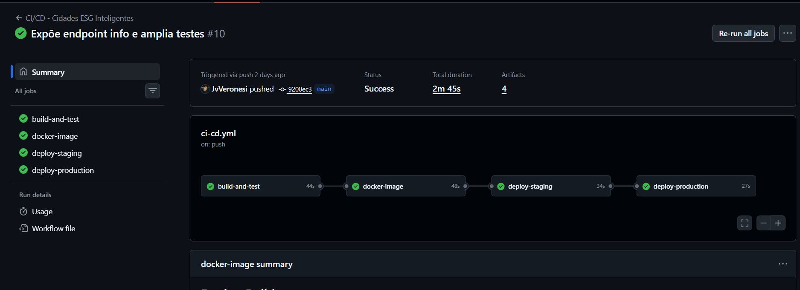

# Projeto - Cidades ESG Inteligentes

**Disciplina:** DevOps  
**Integrantes:** Alvaro Miranda, João Victor, Vitor Viana, Leonardo Sabbatini

API REST (Java Spring Boot) para registrar iniciativas de sustentabilidade de cidades, acompanhar o impacto estimado e classificar cada iniciativa nos pilares **Ambiental, Social e Governança (ESG)**. Este repositório aplica o ciclo DevOps completo: build, testes, containerização, orquestração e deploy automatizado em **staging** e **produção**.

**Repositório:** [github.com/alvinhooo/cidades-esg-inteligentes](https://github.com/alvinhooo/cidades-esg-inteligentes)  
**Pipeline:** [GitHub Actions](https://github.com/alvinhooo/cidades-esg-inteligentes/actions)  
**Imagem:** [GitHub Packages](https://github.com/users/alvinhooo/packages?repo_name=cidades-esg-inteligentes)

## Estrutura do projeto

```
cidades-esg-inteligentes/
├── .github/workflows/ci-cd.yml   # pipeline CI/CD (GitHub Actions)
├── src/                          # código-fonte Java e testes
├── scripts/smoke-test.sh         # validação automática de cada deploy
├── docs/evidencias/              # prints do pipeline e dos ambientes
├── Dockerfile
├── docker-compose.yml            # app + PostgreSQL (profiles staging e production)
├── .env.example
├── pom.xml
└── README.md
```

## Como executar localmente com Docker

Pré-requisitos: Docker e Docker Compose v2.

1. Copie as variáveis de exemplo: `cp .env.example .env` (ajuste a senha se desejar).
2. Suba **staging** (porta 8081): `docker compose --env-file .env --profile staging up --build -d`
3. Verifique a saúde: `curl http://localhost:8081/actuator/health`
4. Verifique o ambiente: `curl http://localhost:8081/actuator/info` → `{"ambiente":"staging"}`
5. Suba **produção** (porta 8082): `docker compose --env-file .env --profile production up --build -d`
6. Teste: `curl http://localhost:8082/actuator/health` e `curl http://localhost:8082/api/iniciativas`
7. Encerre e remova tudo: `docker compose --profile staging --profile production down -v`

## Pipeline CI/CD

**Ferramenta:** GitHub Actions (`.github/workflows/ci-cd.yml`). Dispara em *pull requests* e *push* na `main` (e manualmente via `workflow_dispatch`).

| Job | Quando roda | O que faz |
| --- | --- | --- |
| `build-and-test` | PR e push | `mvn clean verify`: compila e executa 4 testes automatizados (H2 em memória); publica o relatório Surefire como artefato |
| `docker-image` | após os testes | Faz o build da imagem Docker e publica no GitHub Container Registry (GHCR) com a tag do commit; em PRs apenas valida o build |
| `deploy-staging` | push na `main` | Baixa a imagem do GHCR, sobe app + PostgreSQL com o profile `staging` e executa o *smoke test* (health, info, POST e GET) |
| `deploy-production` | após staging aprovado | Sobe a **mesma imagem** validada em staging com o profile `production` (banco, rede e volume próprios) e executa o smoke test |

Pontos importantes:

- **Build uma vez, implanta o mesmo artefato:** a imagem é construída uma única vez e promovida de staging para produção.
- **Promoção condicionada:** produção só executa se testes, imagem e staging passarem. PRs nunca fazem deploy.
- **Ambientes:** os jobs usam *GitHub Environments* (`staging` e `production`). Em `Settings > Environments > production` é possível exigir aprovação manual.
- **Segredos:** a senha do banco usa o secret opcional `POSTGRES_PASSWORD`; sem ele, usa uma senha temporária descartável, pois os ambientes do CI vivem apenas durante o job.
- **Evidência:** cada deploy escreve um resumo (health, info, POST/GET) na aba *Summary* e publica logs, estado dos containers e resultado do smoke test como artefatos para download.
- Os ambientes de CI são efêmeros (runner do GitHub). Para ambientes persistentes, rode localmente conforme a seção anterior.

## Containerização

Conteúdo do `Dockerfile`:

```dockerfile
FROM maven:3.9.9-eclipse-temurin-21 AS build
WORKDIR /workspace
COPY pom.xml .
RUN mvn -q -DskipTests dependency:go-offline
COPY src ./src
RUN mvn -q clean package -DskipTests

FROM eclipse-temurin:21-jre-alpine
RUN addgroup -S spring && adduser -S spring -G spring
WORKDIR /app
COPY --from=build /workspace/target/*.jar app.jar
USER spring:spring
EXPOSE 8080
HEALTHCHECK --interval=30s --timeout=5s --start-period=30s --retries=3 CMD wget -qO- http://localhost:8080/actuator/health || exit 1
ENTRYPOINT ["java", "-jar", "/app/app.jar"]
```

Estratégias adotadas:

- **Multi-stage build:** JDK + Maven apenas na etapa de build; a imagem final usa JRE 21 Alpine (menor e com menos superfície de ataque).
- **Cache de dependências:** `pom.xml` copiado antes do código, reaproveitando a camada do Maven.
- **Segurança:** a aplicação roda com usuário não-root (`spring`).
- **Healthcheck** nativo apontando para o Spring Actuator.
- `.dockerignore` evita enviar `target/`, `.git` e `.env` ao contexto de build.

Orquestração (`docker-compose.yml`): dois *profiles* (`staging` e `production`), cada um com **aplicação + PostgreSQL 16**, **volume** próprio para dados (`postgres-staging`, `postgres-production`), **rede** isolada (`staging-net`, `production-net`) e **variáveis de ambiente** vindas do `.env`. A aplicação só inicia após o banco ficar saudável (`depends_on` + `healthcheck`).

## Evidências do funcionamento

As evidências verificáveis ficam disponíveis na [execução do pipeline](https://github.com/alvinhooo/cidades-esg-inteligentes/actions) e incluem:

- relatório Surefire dos testes;
- imagem versionada no GHCR com a tag do commit;
- Summary dos smoke tests de staging e produção;
- artefatos `evidencias-staging-<sha>` e `evidencias-production-<sha>`;
- logs do Compose e estado dos containers de cada ambiente.

O procedimento para obter e nomear as capturas está em [`docs/EVIDENCIAS.md`](docs/EVIDENCIAS.md). Depois de capturadas, as imagens abaixo passam a aparecer automaticamente no GitHub.

### Pipeline no GitHub Actions



### Staging


### Produção


## Tecnologias utilizadas

- Java 21, Spring Boot 3.3, Spring Web, Spring Data JPA e Actuator
- JUnit 5, Spring Boot Test e MockMvc
- PostgreSQL 16 (ambientes) e H2 (testes)
- Maven
- Docker e Docker Compose
- GitHub Actions e GitHub Container Registry (GHCR)

## Endpoints principais

| Método | Rota | Finalidade |
| --- | --- | --- |
| GET | `/api/iniciativas` | Lista iniciativas ESG |
| POST | `/api/iniciativas` | Cria iniciativa |
| PATCH | `/api/iniciativas/{id}/status?status=EM_ANDAMENTO` | Atualiza status |
| GET | `/actuator/health` | Health check |
| GET | `/actuator/info` | Indica o ambiente (staging/production) |

Exemplo de criação (`POST /api/iniciativas`):

```json
{
  "titulo": "Telhados verdes em escolas",
  "cidade": "São Paulo",
  "pilar": "AMBIENTAL",
  "descricao": "Ampliação da cobertura vegetal em prédios públicos.",
  "impactoEstimado": 420
}
```

## Checklist de entrega

| Item | OK |
| --- | --- |
| Projeto compactado em .ZIP com estrutura organizada | ☑ |
| Dockerfile funcional | ☑ |
| docker-compose.yml ou arquivos Kubernetes | ☑ |
| Pipeline com etapas de build, teste e deploy | ☑ |
| README.md com instruções e links verificáveis | ☑ |
| Documentação técnica em PDF | ☑ |
| Prints anexados ao README e ao PDF | ☐ *(marcar após adicionar os sete arquivos em `docs/evidencias/`)* |
| Deploy realizado nos ambientes staging e produção | ☐ *(marcar após o workflow ficar verde no GitHub)* |
